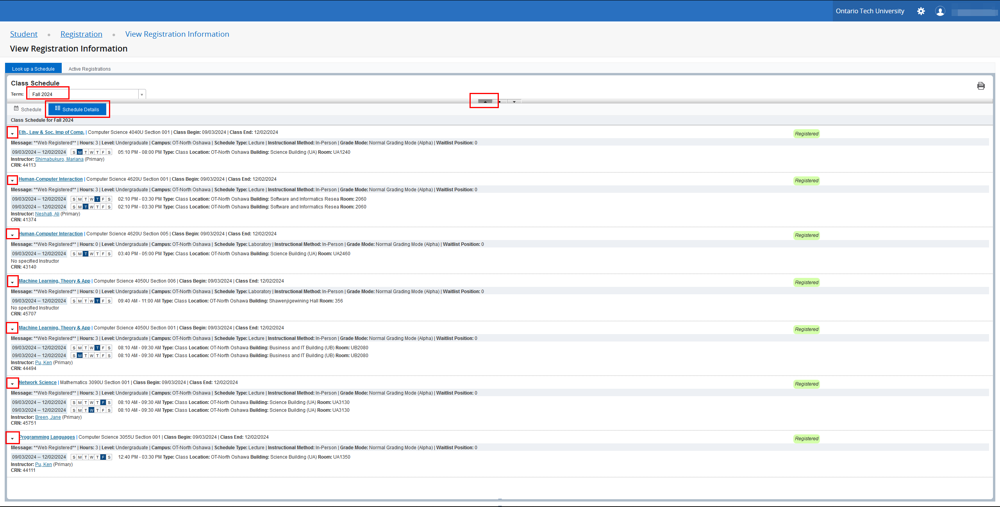
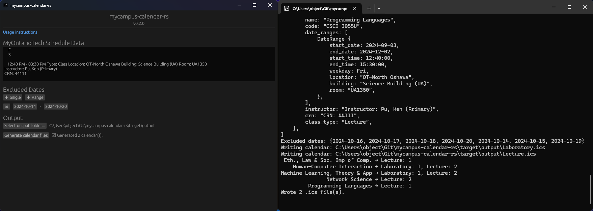

# mycampus-calendar-rs

This is a small program to parse student schedules from MyOntarioTech (formerly MyCampus) into `.ics` files, which can be imported into any calendar app (eg. Google Calendar, Outlook, Apple Calendar). The parser is still working as of Fall 2024. Works with Firefox and (probably) any Chromium-based browser.

## Installation

Download the executable for your OS from [here](https://github.com/object-Object/mycampus-calendar-rs/releases), or clone this repo and build from source.

## Usage

1. Log in to MyOntarioTech and navigate to the Student Schedule page. Select the current term in the dropdown, then go to the Schedule Details tab. Click all of the arrows beside the course names so they're pointing **down** and the gray boxes are showing.
   
2. Press `ctrl + a` then `ctrl + c` to select and copy everything on the page. Don't select it manually or the parsing might not work properly.
3. Run the program.
4. Paste what you copied from MyOntarioTech into the large text field below the "MyOntarioTech Schedule Data" header.
5. Use the "Excluded Dates" section to prevent calendar events from being generated on specific days or date ranges (eg. the mid-semester study week - see https://ontariotechu.ca/current-students/academics/important-dates-and-deadlines.php).
6. Select a folder where the calendar files should be generated, then press the button to generate them.
   
7. Import the generated `.ics` file(s) into a calendar program of your choice.

## Troubleshooting

If the program fails to generate the calendar files, an error message should be displayed in the console window. This probably means the website format changed, so please open a GitHub issue or ping me on Discord if I'm still hanging around (`@leftsquarebracket`). Include the pasted schedule data and the console logs.
